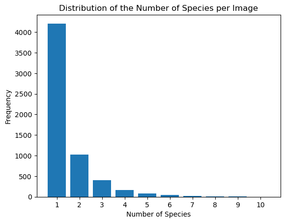

# Diving Deeper: Improving Generalization and Out-of-Sample Detection for Deep-Sea Species Identification

**Authors**:  Edmundo Sanz-Gadea López, Aaron van Diepen

**Accompanying Blog Post**: [Diving Deeper Blog Post](https://cs4245.notion.site/cs4245/Diving-Deeper-Improving-Generalization-and-Out-of-Sample-Detection-for-Deep-Sea-Species-Identificat-cf71d4f8c4ff47cab65dde6d5ad931eb)

# Introduction

In the field of scientific biological research, the identification of deep-sea creatures in images plays a crucial role in understanding marine biodiversity, monitoring population changes, and discovering new species. Advancements in ocean-going camera systems have granted scientists remarkable access to underwater imagery. Additionally, machine learning models have proven effective in sorting visual data and show great potential in the detection and classification of deep-sea creatures. However, these models often struggle to generalize to new scenarios, such as varying cameras, illumination, the emergence of new organisms, and changes in seafloor appearance. This challenge is particularly complex in the dynamic ocean environment. Furthermore, imbalanced datasets and inadequate deep-sea data collection pose additional challenges. The consequence is that existing machine learning models, trained primarily on images from the upper ocean region, struggle to generalize to greater ocean depths.

In this project we aimed to develop a robust computer vision model capable of identifying deep-sea creatures and performing out-of-sample detection. Out-of-sample detection refers to the assessment of whether new images come from a different distribution relative to the training data. Out-of-sample detection can help scientists identify species that were not adequately represented in the training data and identify changes in species distributions. Our project aimed to enhance out-of-sample detection for multi-label classification of deep-sea creature images while improving the model's ability to handle varying underwater image illumination and visibility conditions, which results in better generalization for images in conditions and depths not present in the training set.

To accurately reflect the real-world challenges presented, the model is trained and tested using different data distributions. The training images are collected within the upper ocean region, up to a depth of 800 meters, while the testing images cover a greater range of depths, up to 1300 meters. This scenario aligns with the common situation in ocean research where accessing deeper waters proves difficult, and annotated data is more readily available closer to the surface. The species distributions often overlap but diverge as the vertical distance between samples increases. The evaluation of the model assesses the ability of the model to identify creatures in the image and accurately perform out-of-sample detection, predicting whether an image originates from a different distribution compared to the training data. 

# Data

The project utilizes the [FathomNet dataset](https://fathomnet.org/fathomnet/#/), which is an open-source collection of annotated underwater images depicting various species. These images were captured using a camera system deployed by the [Monterey Bay Aquarium Research Institute (MBARI)](https://www.mbari.org/) on Remotely Operated Vehicles along the Central California coast. The depth of the image capture ranges from the surface to 1300 meters.

To ensure effective training and evaluation, the dataset is divided into distinct sets: training, validation, and a final test set. The training and validation sets specifically include images from the upper ocean, with depths less than 800 meters. In contrast, the test set is derived from deeper waters, covering the entire range from the surface to a depth of 1300 meters. Although the species distributions in these regions overlap, they are not identical, presenting a challenge in the classification task.

The training and validation sets consist of 5950 images of different resolutions. Each image is identified by a unique ID and the dataset provides annotations consisting of a list of categories associated with the species present in the image. In the provided CSV file there are a total of 290 categories representing bottom dwelling animal species, denoted by numerical values. However, in the training and validation datasets, only 133 species are present. Additionally, the categories are further classified into 20 semantic parent categories, such as fish, urchin, and anemone, among others. The figure below displays nine randomly selected images along with their respective parent categories. Observing the images, it becomes evident that they present issues such as inadequate illumination and focus, making it challenging to discern the animals. These factors pose significant challenges for the model's performance.

The dataset presents an additional challenge arising from the data imbalance. As illustrated in the figure below, which showcases the distribution of parent categories, only a few animal species are heavily represented in the dataset, resulting in a very uneven distribution. The model's ability to generalize across all categories is hindered by this imbalance because the model becomes biased towards recognizing and classifying the overrepresented classes, due to the limited exposure it has to the minority classes during training.

The challenge becomes even more pronounced when we consider the fine-grained categories instead of the parent categories. The most represented category contains over 2500 samples, while there is a long tail of underrepresented categories. There are 102 species that have fewer than 50 images, 73 of which have fewer than 10 images, and 25 species that are represented by only a single image. This presents an immense challenge for the model to effectively learn and classify species with such a limited number of instances.

Examining the distribution of the number of species per image, the figure presented below shows that most images contain only one animal species and less than twenty percent of the images depict more than three species. At first glance, this could suggest that multi-label classification would be relatively easier for the model. However, there is still a fraction of images that include multiple species and it is crucial to account for the fact that the distribution of the number of species per image might differ in the evaluation dataset. Combining the number of species per image with the previous analysis showing the distribution of species, it becomes apparent that a substantial number of images predominantly feature a specific species, identified as species ID 160, Strongylocentrotus fragilis, which belongs to the Urchin family. Exploring the habitat and range of this species reveals that it thrives in the abyssal depths along the western coast of North America, and distribution spans the continental shelf and slope, with the highest concentration observed within the depth range of 200-300 meters [1]. Consequently, we expect that this species will be less prevalent in the test set, making the challenge of data imbalance even more pronounced.

# Multi-label Classification

We train the model in the context of multi-label classification [2], which refers to the task of assigning multiple categories or labels to each image. Instead of categorizing images into a single category or species, the goal is to identify all the animal species present in each image. 

### Multi-label Classification - Parent Categories

In the context of multi-label classification, our first aim was to categorize deep-sea creature images into the provided parent categories, providing a broader classification of the species present in each image. This approach aimed to reduce the number of categories while capturing the general characteristics and groupings of the organisms, facilitating easier training and analysis.

To begin, we analyzed the category distribution within the dataset. We filtered the categories in each image, excluding those with an insufficient number of instances. As a result, the least frequent categories, namely 'crab' and 'worm', were eliminated due to insufficient training data. With the filtered categories, we proceeded to define the `DataBlock` for the model using the Fastai PyTorch wrapper. The `DataBlock` determined the structure and transformations applied to the data during training and validation. In this case, we utilized the `ImageBlock` to handle the image data and the `MultiCategoryBlock` to accommodate the multiple parent categories assigned to each image.

To load the data into the model, we used a `DataFrame` containing the images and their respective filtered categories. The `get_x` and `get_y` functions were defined to extract the image paths and the list of parent categories, respectively. Additionally, we resized all images to a uniform size of 460 pixels, as the dataset provided images with varying sizes. To split the data into training and validation sets, we employed a random splitter with a fixed seed value, maintaining an 80/20 training to validation ratio.

For the model architecture, we selected a pre-trained ResNet34 convolutional neural network (CNN). ResNet34 is known for its effectiveness in image classification tasks, including multi-label classification. Although we experimented with other models, such as ResNet50, the marginal improvement in accuracy and the risk of overfitting did not justify the longer training times.

Before training the model, we optimized the learning rate using a learning rate finder. This process determines the optimal learning rate by evaluating the model's performance at different learning rates. The results of this optimization can be found below:

Rather than selecting the minimum rate, the orange point was chosen, which belongs to a descending portion of the learning rate curve where the loss is still improving rapidly. This approach balances between slow convergence at low rates and poor performance at high rates.

Next, the model was trained, fine-tuning the pre-trained weights to our specific classification task. The model underwent 10 epochs of fine-tuning, with a base learning rate set to the suggested value. 

| epoch | train_loss | valid_loss | accuracy_multi |
| --- | --- | --- | --- |
| 0 | 0.229575 | 0.188916 | 0.924825 |
| 1 | 0.234959 | 0.197056 | 0.926215 |
| 2 | 0.228022 | 0.208164 | 0.924281 |
| 3 | 0.205969 | 0.187737 | 0.931049 |
| 4 | 0.226572 | 0.233985 | 0.926456 |
| 5 | 0.199401 | 0.167456 | 0.935763 |
| 6 | 0.185407 | 0.164661 | 0.936004 |
| 7 | 0.175381 | 0.156727 | 0.938422 |
| 8 | 0.168618 | 0.153078 | 0.941081 |
| 9 | 0.171843 | 0.154035 | 0.941443 |

The `accuracy_multi` metric used for multi-label classification reflects the accuracy of predictions for individual labels, rather than per image or group. It accounts for correct predictions for each label and penalizes incorrect predictions. The metric utilizes the sigmoid function to transform the input values into a range between 0 and 1, representing the probability of each label being present. It then compares these probabilities to a threshold value and checks if the predictions match the target labels in Boolean form. The result is converted back to a numerical value and the mean is calculated across all labels. The `threshold` hyperparameter sets the threshold for classifying predictions. The model only predicts labels if its confidence is above the threshold. For this model, a threshold of 0.1 was used. Lower thresholds increase positives, so results in higher recall, but raise false positives, resulting in lower precision.

The figure below displays the model results for nine randomly selected images. Each image is accompanied by the ground truth label above and the corresponding model prediction below. The model demonstrates accurate predictions for single-label images, but faces challenges when multiple species are present in an image, struggling to classify all of them.

### Multi-label Classification - Fine-Grained Categories

The next step was to train a model, not only on the parent categories, but using all the fine-grained categories. This is a much more challenging task because the fine-grained categories exhibit a higher degree of specificity and granularity, requiring the model to distinguish between closely related species. With a significantly larger number of categories, including many with limited training data, the model faces the challenge of effectively learning and generalizing across the diverse range of deep-sea creatures. The imbalanced distribution of fine-grained categories further compounds the difficulty, as the model is likely to be biased towards the overrepresented categories, neglecting the underrepresented ones. Moreover, the presence of multiple species in one image continues to be challenging for the model. 

An example of nine randomly selected images from the training set is shown below. The numerical values on top of the images indicate the IDs of the species present.

**Data Augmentation and Oversampling**

To address the imbalanced distribution of fine-grained categories in the training data and improve the performance of the model, two techniques were employed: data augmentation and oversampling. [3]

For data augmentation, the `aug_transforms` function was used to apply various transformations to the training data. The transformations chosen aim to replicate the variability that can arise in underwater images taken by remotely operated vehicles. The transformations chosen are applied randomly to the images and include flipping the images horizontally and vertically, rotating the images, applying zooming with a maximum scaling factor of 1.1, adjusting the lighting conditions of the images by changing their brightness and contrast, and warping the images by distorting their shape by a maximum of 20%. The probability of applying these transformations is controlled by the `p_affine` and `p_lighting` parameters, which were set to 0.75. Additionally, the images are resized to a final size of 224x224 pixels after all the transformations have been applied. 

By applying these augmentation transformations, the model is exposed to a wider range of image variations. This increases the diversity of the training data, making the model more robust and better able to generalize to unseen images during inference.

To further address the data imbalance, an oversampling technique was also implemented in the `oversample` function . Samples from categories with a low number of instances were duplicated until a desired minimum number of twenty instances is reached. By oversampling the underrepresented species, the training set becomes more balanced, reducing the bias towards the overrepresented categories. This helps the model to learn effectively from all categories, even those with limited training data. Furthermore, since the transformations are also applied to oversampled images, a wider variety of training data was obtained.

**Model Architecture and Training**

To load and preprocess the data, a similar procedure to the previous case was followed. A `DataBlock` object was created using the `DataBlock` class, but with a modification in the splitter parameter. This parameter was set to split the data into training and validation sets, with 40% of the data allocated for validation. The reason behind this choice of percentages was to ensure that even categories with the fewest instances were adequately represented in both the training and validation sets. The `get_x` and `get_y` functions were defined to extract the image paths and the corresponding list of categories from the oversampled dataframe, Lastly, all images were resized all images to a uniform size of 460 pixels.

The model architecture utilized was again a pre-trained ResNet34 convolutional neural network and once more the `accuracy_multi` metric was utilized to assess the model's performance. To customize this metric, the partial function was used to set a threshold of 0.1, which determines the classification boundary for predictions, ensuring that predictions are considered accurate if they surpass this value for individual labels.

Before proceeding with model training, an optimal learning rate was determined using the `lr_find` method. In this case, the optimal learning rate was found to be 0.0025.

After determining the optimal learning rate, the model underwent fine-tuning for 5 epochs using the `fine_tune` method. The performance of the model was then evaluated using the validation set, where the loss and multi-label accuracy metrics were calculated using the `validate` method. The evaluation yielded the following results:

- Loss: 0.077988
- Multi-label Accuracy: 0.975908

In the figure below, predictions for nine randomly sampled images from the evaluation set are displayed. It can be observed that the model correctly predicts the species categories when it does make predictions. However, it faces challenges in predicting all of the categories and sometimes returns empty predictions. This issue stems from the threshold value being set too high, causing the model's confidence in all categories to fall below the threshold. To address this, an additional function was implemented. If the model does not provide any predictions for an image, the list of confidences for that image is obtained, and the category with the highest confidence is selected. This solution proves suitable for the current task since all images in the dataset contain at least one animal species. However, when deploying the model in real-world scenarios the approach of selecting the highest confidence would not be employed and the threshold-based approach would be maintained for all images. The reason is that in natural environments, many of the images captured by the underwater vehicle may not contain any animal species.

# Out-of-Sample Detection

We train a secondary model to perform out-of-sample detection on new input images, which represents the likelihood that an image is from the same distribution as the training distribution. The methodology used in this research is based on [4].

In order to analyze the performance of the model we split the data into a training and evaluation set, where the evaluation set covers images obtained from the entire range from the surface to a depth of 1300 meters, while the training set is the collection of well labeled images with depths less than 800 meters.

To generate an out-of-sample value, we first scale the images to **224x224** after which we input them into a pre-trained ResNet50 convolutional neural network model without a final linear layer. The Resnet50 model outputs a feature embedding with a length of *2048* for each image. A k-nearest neighbor model (KNN) with k=100, which uses the 100 nearest feature embeddings -based on cosine distance-, is then trained on the feature embeddings for the training set. To calculate the likelihood of an image from the evaluation set to be out of sample the distances output by the training step are averaged and this average is stored.

We then run the evaluation set through the same Resnet50 model and again obtain feature embeddings of length *2048* for each image. After running these through the same knn we obtain the average distance to its 100 nearest feature embeddings. These distances are then scaled to a range from 0 to 1 based on the average distance that the KNN output for the training se. 0 indicates a low distance to its 100 nearest feature embeddings, meaning the sample is likely to resemble images present in the training data, while 1 represents an outlier which is likely to not resemble any images present in the training data.

Below we see the distributions for out of sample detection for the training set and evaluation set, where the red line represents the 95th percentile of the training set. It clearly shows that a large amount of images in the evaluation set is accurately detected as outliers, while a part of the data is detected as closely resembling the images present in the training data.

Based on these scores we visualize the lowest scoring images, which are the images most likely to be present in the training data. As we can see these are images of the sea floor that are not lower than 800 meters. These images are rated to be likely from the same distribution because there are a lot of similar looking images present in the training set.

Based on these scores we also visualize the highest scoring images, which are the images most likely to not be resembled by any training data. As is clearly visible almost all of these images are from deep-water coral, which is simply not present in the training data since these types of coral live on the sea-bed and are less likely to occur at shallow depths.

### Explainability

Next we wanted to add some explainablity to the model for why a certain image was labeled as being out-of-sample.

Uniform Manifold Approximation and Projection (UMAP) is a dimension reduction technique that can be used for visualization similarly to t-SNE, but also for general non-linear dimension reduction. [5]

To show why an image was labeled as out-of-sample by the KNN we created UMAP plots in order to visualize the distributions and validate the accuracy of the scoring -performed by the KNN using cosine distance- using visual means. We input the feature embeddings of both training and evaluation set into the UMAP function and receive a 2 dimensional array containing the UMAP positions for each feature embedding.

After this we first visualize the training distribution as a density plot using hexagonal bins to visualize the areas wwhere the images from the training distribution are most commonly located. We then overlay this with a scatter-plot showing the locations of the individual feature embeddings present in the evaluation distribution. This gives us a clear view of why some images are marked as likely to be out of sample while others are marked as likely to be from the same distribution as the training data.

The green data points resemble the 100 most out of sample images from the distribution. Which clearly shows that there are few if any images present in the training distribution that closely resemble them, indicating that these images will be problematic for our segmentation model.

Next we wanted to visualize what parts of an image caused it to be labeled as out of sample, since this could help scientists identify what parts of an image the model deems to have never been trained on.

GRAD-CAM++ is an improvement of GRAD-CAM, which aims to visualize explanations of convolutional neural network models predictions based on a weighted combination of the positive partial derivatives of the last convolutional layer feature maps [6]. The final output of GRAD-CAM++ is a heatmap of the pixels that most influenced the final score for a certain output of the model.

An attempt was done to use GRAD-CAM++ to visualize which areas in a certain image -that was labeled as out of sample- caused the model to label it as out of sample. This however required us to run GRAD-CAM++ for all of 2048 values output when the feature embedding was created, which took more than 30 minutes for a single image. Unfortunately not enough time was available to improve the performance of GRAD-CAM++ on parallel tasks, therefore this part of the project was dropped in favor of improving the UMAP visualization. If GRAD-CAM++ was faster to compute or could have been parallelized in order to fit this desired requirement, the attempt would have been to use the 100 nearest neighbors for an image to rank the features based on their influence on the distance score and use this weighted vector in combination with the heatmap created using GRAD-CAM++ to combine the heatmaps into a scaled combination showing the pixels that were most responsible for the image being labeled as out of sample.

# Evaluation

For the final evaluation the test dataset was used which consists of 10744 images taken from a different depth distribution compared to the training and validation sets. The evaluation of the model considered both the predicted species labels and the out-of-sample score. The out-of-sample predictions were assessed using the rescaled AUCROC score, defined as follows:

$$
sAUC = 2AUC-1
$$

The predictions of species categories were evaluated based on the Mean Average Precision at 20 (MAP@20) metric. MAP@20 calculates the average precision for each image up to the top 20 predictions. The formula for MAP@20 is:

$$
MAP@20 =  \frac{1}{U} \sum_{u=1}^{U} \sum_{k=1}^{min(n,20)} P(k) \times rel(k)
$$

In the formula, U represents the total number of images, P(k) denotes the precision at cutoff k, n represents the number of predictions per image, and rel(k) is an indicator function that equals 1 if the item at rank k is a relevant (correct) label, otherwise it is 0.

The final score is the simple average of the rescaled AUCROC and MAP@20:

$$
\frac{1}{2}(sAUC+MAP@20)
$$

The final score for the model, considering both multi-label classification and out-of-sample detection was **0.218**. The low value arises from the challenging dataset used. The dataset contained imbalanced data with a limited number of instances for many species, making it difficult for the model to accurately classify and generalize to unseen images. Additionally, the model struggled with images that contained multiple species, often failing to classify all of them correctly. Most important however, and observed from the difference in performance between validation and test set is the different data distribution of images taken at different depths.

# Conclusion

In conclusion, this paper presented a comprehensive investigation into deep sea creature detection using an existing image dataset predominantly comprised of labeled images from depths of 800 meters or less. Although the achieved results may not be outstanding, they undoubtedly serve as a solid stepping stone for future advancements in the field.

The primary focus of this research was to explore the feasibility of creating a deep sea creature detection model. Using a ResNet34 model combined with data augmentation and oversampling, we attempted to create a model that can successfully detect sea creatures.

The secondary focus of this research was extending the deep sea creature detection capabilities to depths beyond the dataset's original scope. Through the application of out-of-sample detection techniques, we attempted to identify and classify deep sea creatures from images captured at greater depths, where the dataset lacked labeled examples. The final solution combining a ResNet50 model to create feature embeddings and then using a knn to rank outliers, generated visually desirable results.

Additionally, the incorporation of explainability into the out-of-sample detection process is a novel idea. By attempting to developing techniques to interpret the decision-making process of the model, we attempted to enhance the transparency and interpretability of their approach. This is particularly important in scientific domains where human experts require explanations and justifications for the model's predictions. However, this work should be further continued in future research as sadly time restriction caused this research to be terminated.

### Limitations

Due to time and resource restrictions the models used in this research are efficient, but can also be identified as one of the causes for why the achieved results may not have met the highest standards of accuracy and robustness. The developed models do however lay a solid foundation for future research in this domain and can serve as a starting point for further investigations into deep sea creature detection at greater depths.

The same time and resource restrictions unfortunately also caused the GRAD-CAM++ based explainability for out-of-sample detection to be cut short. In future work this method should be implemented and GRAD-CAM++ should be parallelized for vectors to make the use of this method more viable.

### Recommendations

Moving forward, it is imperative to continue refining and expanding the existing image dataset, especially by including labeled samples from deeper depths. This will enable the development of more accurate and reliable models capable of detecting and classifying a wider range of deep sea creatures.

Furthermore, future research should focus on optimizing the out-of-sample detection algorithms and sea creature detection models. It should also continue the research into explainability for out of sample detection, potentially with improved models.

A Gaussian mixture model is a probabilistic model that assumes all the data points are generated from a mixture of a finite number of Gaussian distributions with unknown parameters. Gaussian mixture models can be thought of as generalizing k-means clustering to incorporate information about the covariance structure of the data as well as the centers of the latent Gaussians.

A Gaussian mixture model can potentially improve the out-of-distribution detection model further, therefore this approach should also be attempted.

# References

[1] Sato, Kirk; Powell, Jackson; Rudie, Dave; Levin, Lisa (May 2018). "Evaluating the promise and pitfalls of a potential climate change–tolerant sea urchin fishery in southern California". *ICES Journal of Marine Science*. **75**: 1029–1041.

[2] Jian Wu, Victor S. Sheng, Jing Zhang, Hua Li, Tetiana Dadakova, Christine Leon Swisher, Zhiming Cui, and Pengpeng Zhao. 2020. Multi-Label Active Learning Algorithms for Image Classification: Overview and Future Promise. ACM Comput. Surv. 53, 2, Article 28 (March 2021), 35 pages. [https://doi.org/10.1145/3379504](https://doi.org/10.1145/3379504)

[3] Adane Nega Tarekegn, Mario Giacobini, Krzysztof Michalak. 2020. A review of methods for imbalanced multi-label classification. Pattern recognition, Volume 118, October 2021, 107965. [https://doi.org/10.1016/j.patcog.2021.107965](https://doi.org/10.1016/j.patcog.2021.107965)

[4] Johnson Kuan and Jonas Mueller. 2022. Back to the Basics: Revisiting Out-of-Distribution Detection Baselines. [https://doi.org/10.48550/arXiv.2207.03061](https://doi.org/10.48550/arXiv.2207.03061)

[5] McInnes, L., Healy, J. J., Saul, N., Großberger, L. (2018). Umap: Uniform Manifold Approximation and Projection. JOSS, 29(3), 861. [https://doi.org/10.21105/joss.00861](https://doi.org/10.21105/joss.00861)

[6] A. Chattopadhay, A. Sarkar, P. Howlader and V. N. Balasubramanian,
"Grad-CAM++: Generalized Gradient-Based Visual Explanations for Deep
Convolutional Networks," *2018 IEEE Winter Conference on Applications of Computer Vision (WACV)*, Lake Tahoe, NV, USA, 2018, pp. 839-847, doi: 10.1109/WACV.2018.00097.
